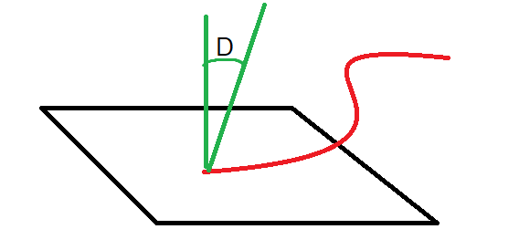

# SESSION 3

## Exercise 1

In the realm of TVA, Miss. Minute has some problem with the conversions
of the data. She now seeks your advanced programming knowledge to help
to resolve the issue. While converting data she found out that there are
some miscalculations. She wants you to write a program that gives a
double as an input and show the missing value while casting the double
into an int. Therefore you need to write a program that demonstrates
precision loss when casting a double to an int. Print the original
double value and the resulting int after casting and the missing value.

The input and output schema:
```
Enter a double value:

10.69420

Original double value: 10.6942

Value after casting to int: 10

Precision loss: 0.6942000000000004
```

## Exercise 2

While Miss. Minute fixed the issue with the data loss, she found out
that the system can not handle **Infinity**!

Your job is to create a program and show the possibility of having
**Infinity** without getting the divided by zero exception!

Seems hard but in fact it’s just a simple line of code!

At the same time we need a value for that Infinity to define it in the
system.

Hint:

$\large \infty \sim \frac{r}{0} \ | \ r= real \ number$

Use Math.round()

## Exercise 3

The whole TVA system is working like 80’s computer system. Has some
problem with the storing string and characters. Miss. Minute asks you to
write a program that converts your name to integer. For example if your
name is Efe, your integer value of the name is: 69102101

E: 69, f: 102, e:101

## Exercise 4

We have a device in TVA that absorbs the energy from the time strings
floating in the air! We need to find the maximum energy absorbed by the
device. Each time string hit the panel of the device in a certain angle.
The formula for the energy is

*E* = *L* \* *s**i**n*(cos<sup> − 1</sup>*D*)

The L is the length of the String, the D is the degree of the string
with the panel.



The input of the program is going to be a single line of 2 doubles,
First going to be the length(L) and the second is going to be the
degree(D).

Careful: You have to change the D to radiant

Your output should be a single number of maximum Energy!

The input and output schema:
```
2 doubles:

10 45

Energy = 6.1899089244666206
```