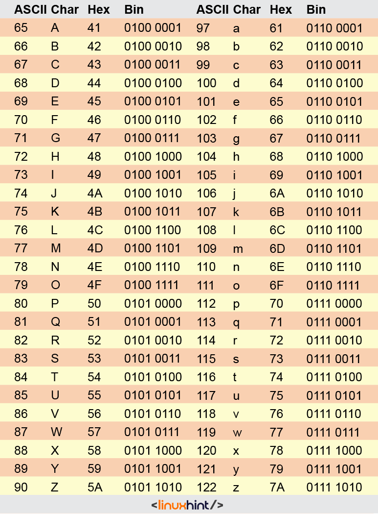

# Session 4

## Exercise 1

In the year 2423, Kepler-186f, another planet similar to Earth, is a
very known holiday destination. Leila opened a transport business. She’s
trying to find a way to give the best cost for transporting people and
their cargo.

For this matter, Leila gives you a job to determine shipping costs based
on weight and destination.

The input of the Java program is going to be either 4 or 5 lines.

The first line is going to be either “Earth” or “Kepler-186f” which is
the starting point.

The second line is the destination. It can be either “Earth” or
“Kepler-186f” again.

The third line is going to be a Boolean to see if there will be a cargo.

The 4th line is going to be the distance. A double in KM between 0 and
2000.

In the case of existing cargo, we will give a 5th line with the weight
of the cargo. A double form of KG between 0 and 5000.

If the transform is between planets an addition of 10^10 KM will be
charged.

The price is `$/KM 25` and `$/KG 35`.

The Input/Output sample:

```
Start:

Earth

destination:

Kepler-186f

hasCargo:

True

distance:

1007.42

cargoWeight:

4001

Total transport cost: $2.500001652205E11
```

## Exercise 2

On planet Kepler-186f we need to implement the same rules as the Earth.
But first, we need to simulate it here on Earth then we can implement it
over there. The part that missing from the simulation is the Traffic
Light. We need you to implement a Traffic Light Simulator. Simulate a
traffic light using a nested if-else. We have 3 colors, and 2 symbols
for turning right and left.

Your application will be given a 5 scenario instruction and your program
needs to give the output accordingly.

The instructions are a combination of the “green, yellow, red” for the
colors, and “right, left” for the turning.

The input is only one string including one color and one direction.

“green”: “go” + direction

“yellow”: “Slow down” + direction + “if safe”

“red”: “stop”

The Input/Output sample:

```
Start:

yellow

right

Slow down and turn right if safe
```

## Exercise 3

Leila now facing a new challenge and needs your help.

Their cargo verification system has been broken and not working. They
managed to restore some parts of the code but since the system had been
damaged, when the program started compiling only 6 statements could get
executed. You need to complete the code and make the system work. The
system will give a single line as input and get only a single Boolean
output. The input contains 3 numbers that are separated by space. You
have to do an AND operation between the first 2 and verify if it’s the
3<sup>rd</sup> number.

Remember: You can only do this in a maximum of 6 statements in the main
function code block!

The restored code is here:

``` java
import __va.__il.Scanner;

p__lic class Verify {
    __blic static vo__ main(String[] args) {
        __anner scanner = new __anner(S__tem.in);
        ___ a = s____er.ne____t();
        __t b  = __anner.next___();
        i__ d = scan___._extI__();
        _______ Res = __________________;
        System.out.println(Res);
    }
}

```

The Input/Output sample:
```
10101 10010 365

false
```

## Exercise 4

For more security of the messages transferring between the two planets,
We came up with an idea. We want you to implement that idea. With the
use of XOR and ASCII numbers of characters create a program to encrypt a
character with a key and then decrypt it back using the same key. You
will read the key from the keyboard and then ask for a character’s ASCII
number to encrypt. After encryption, you print the encrypted character
and then you decrypt it back.

As
a complement, we will give you a table of ASCII characters.

The Input/Output sample:

```
Enter the key (integer):

2

Enter a character to encrypt:

65

Encrypted character: C

Decrypted character: A
```